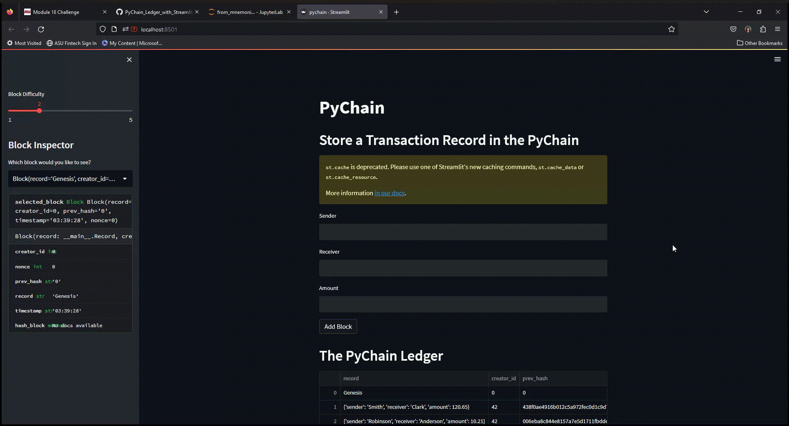
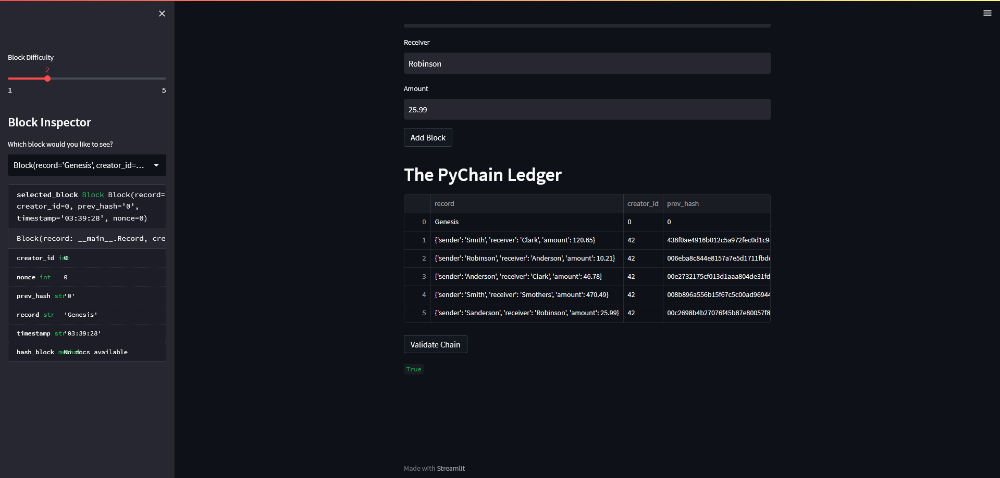

# PyChain

## Overview
This project was to create a streamlit application that utilizes blockchain technology to store transaction ledger data. This application allows users to add blocks with transaction data, and then to validate and view the blockchain in a dataframe. 

## Technologies

This project utilizes the following packages and libraries:
* Python
* Pandas
* Datetime
* hashlib
* Streamlit
* Dataclasses

## Application Examples

Below is a video displaying the application in action. 

Here is a screeenshot of the PyChain Ledger with many blocks already added to display functionality. 

